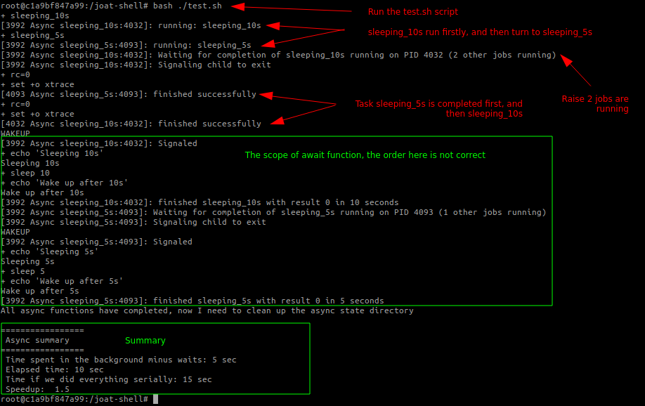

# Joat Shell
## _aka_ Jack-of-all-trades for Shell

# 1. Introduction
- This is a collection of shell scripts that I use to make my life easier.
- Currently, I focus on **async** and **parallel** processing in shell scripts.
- I also have a few scripts for INI file parsing, logging, and other stuff.

# 2. Demo
## 2.1. Demo async
- I use `docker` to launch a container with `bash` shell.
  ```bash
  docker run -it --rm -uroot ubuntu bash
  ```

- Update the package list.
  ```bash
  # inside the container
  apt-get update && apt install -y git
  ```

- Clone the repository.
  ```bash
  # inside the container
  git clone https://github.com/cuongpiger/joat-shell.git --depth 1
  ```

- Go to the `joat-shell` directory and run the [test.sh](./test.sh) script.
  ```bash
  # inside the container
  cd joat-shell
  bash test.sh
  ```
  
